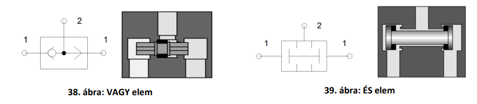

## 1. Logikai elemek, relációk. De Morgan azonosságok. Logikai függvények szabályos (kanonikus) alakjai

- pneumatikus logikai elemek

- De Morgan azonosságok:

$$ \overline{(a \land b)} = \overline{a}\lor\overline{b} $$
$$\overline{(a \lor b)} = \overline{a}\land\overline{b}  $$

- De Morgan azonosságok általánosítva (Shannon szabálya):

$$\overline{[f(x_1, x_2,\ldots, x_n, \cdot, +)]} = f(\overline{x_1}, \overline{x_2}, \ldots, \overline{x_n}, +, \cdot) $$

- kanonikus forma
  - a függvény olyan szisztematikus módon való megadása, melyben minden függvény csak egy módon adható meg
  - (egyértelműség)
  - mintermek
    - logikai szorzatok összege
      - Sum Of Products (SOP)
      - diszjunktív forma
    - pl. \\(F(A,B,C)=m_1+m_3=\overline{A}\cdot\overline{B}\cdot C+\overline{A}\cdot B \cdot C\\)
    - minterm elnevezés → szűkítés (metszetképzés)
  - maxtermek
    - logikai összegek szorzata
      - Product Of Sums (POS)
      - konjunktív forma
    - pl.: \\(F(A,B,C) = M_1\cdot M_2 = (\overline{A}+\overline{B}+C)\cdot(\overline{A}+B+C)\\)
    - maxterm elnevezés → bővítés (unióképzés)
