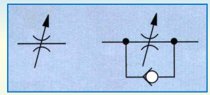
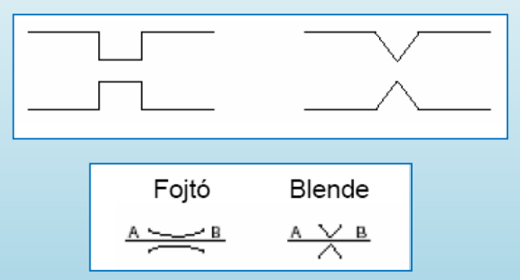
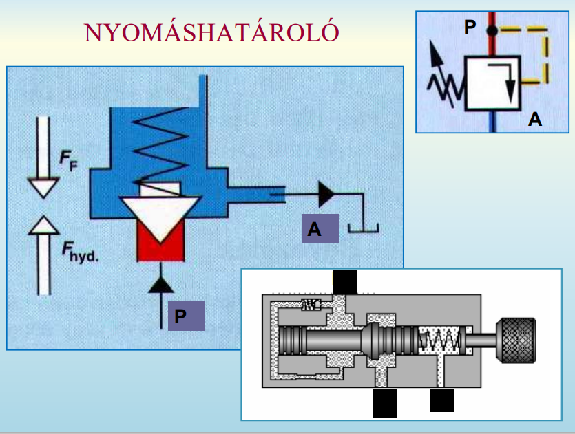
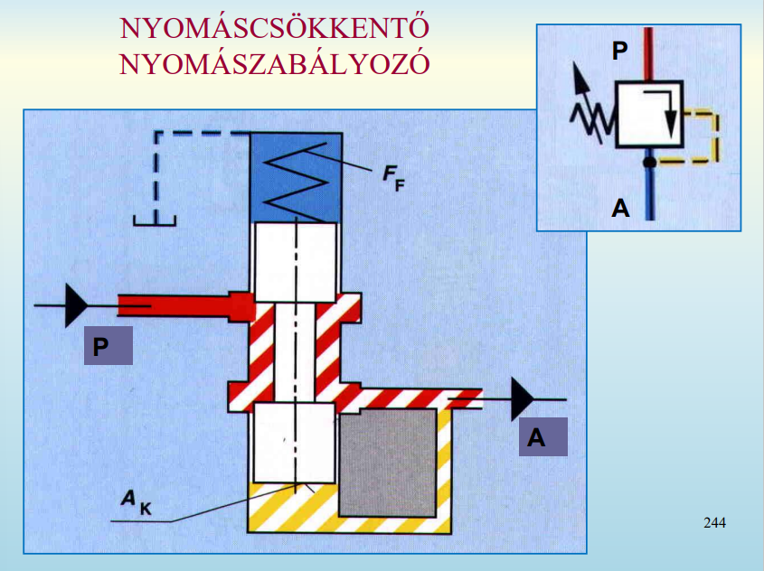
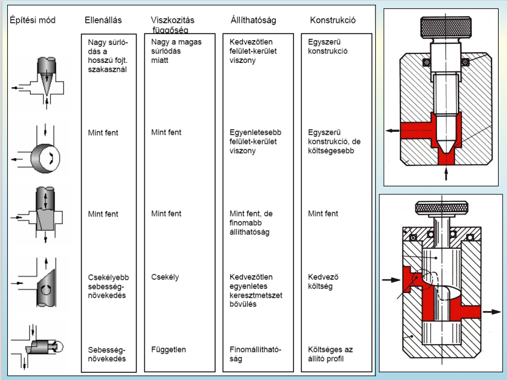

## 10. Nyomáshatároló szerepe a hidraulikus rendszerekben. Hidraulikus fojtások fajtái, jellemzői. 

- nyomáshatároló
	- fojtószelep
	- sok vezérlésnél meghatározott értékű nyomásesés (ellenállás) szükséges, ekkor alkalmazzuk
	- 
	- 
	- 
	- 
	- 
