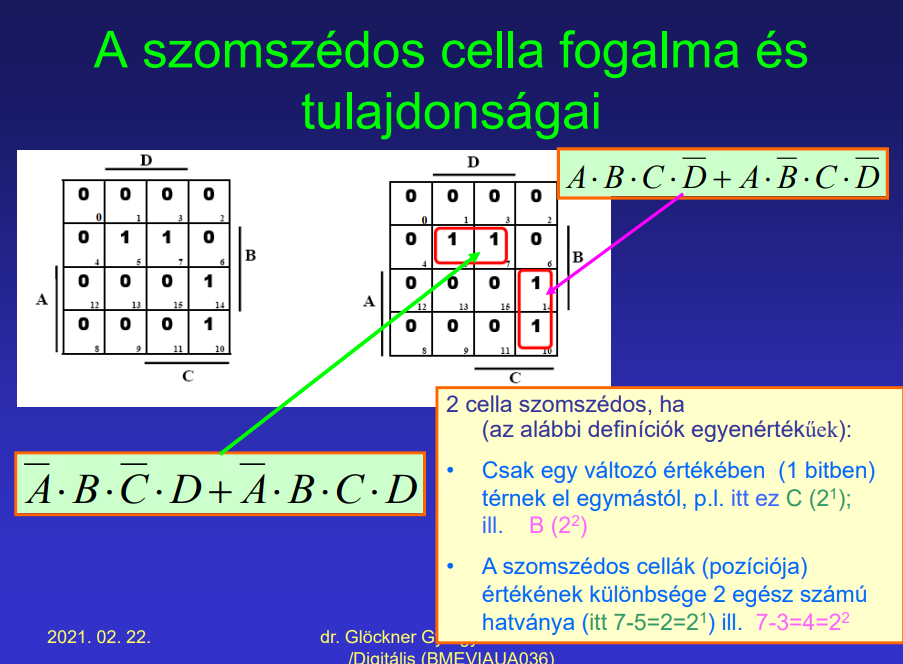

## 2. Egy és két változó logikai függvényei. Logikai függvények egyszerűsítésének módszerei. Egyszerűsítés minterm tábla segítségével

- egy változó logikai függvényei
  - 0 → 0, 1
  - 1 → 0, 1
  - ponálás (állítás), negálás

- két változó logikai függvényei
  - általánosan alkalmazottak
    - AND, OR, XOR
    - NAND, NOR, XNOR
    - NAND, NOR összes kétváltozós függvényt képes előállítani
- egyszerűsítések módszerei
  - algebrai minimalizálás
    - alkalmazható összefüggések:
      - \\(A+1=1\\) és \\(A+\overline{A}=1\\)
    - kiemelés
    - mintermes alak két tagja csak egy változó ponált és negált alakjában különbözik → változó elhagyható
      - pl. \\(\overline{A}\cdot B\cdot C + A\cdot B \cdot C = B\cdot C\\)
  - példa minterm táblás (Karnaugh-táblás?) egyszerűsítésre:

