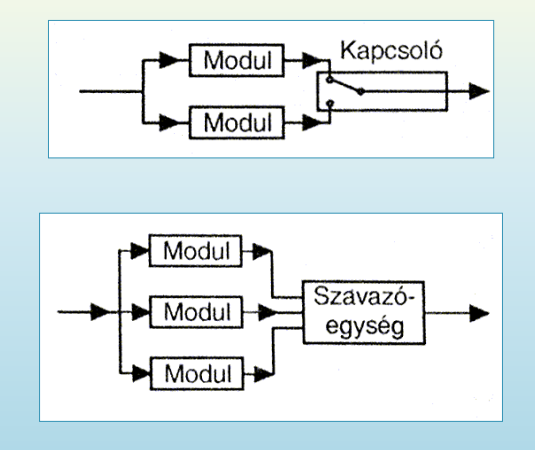

## 4. A vezérlések csoportosítása. Programvezérlés fajtái. Vezérlések megbízhatóságának növelési lehetőségei. Védelmi funkciók ipari rendszerekben

- vezérlés
  - szinkron
    - szükség van valamilyen órajelre, hogy minden folyamat lépése egyszerre játszódjon le
    - Olyan vezérlés, ahol a jelfeldolgozást egy órajel szinkronizálja
  - aszinkron
    - pl. diszkrét logikával (pneumatika)
    - Órajel nélkül működő vezérlés, ahol a jelváltozásokat kizárólag a bemenőjelek megváltozása idézi elő
  - logikai (kombinációs)
    - pl. kombinációs hálózat
    - Olyan vezérlés, amelyik a bemenő jelek állapotaihoz a Boole-algebra logikai múveleteinek megfelelően vannak hozzárendelve a kimenőjelek
  - lefutó (szekvenciális)
    - Előre programozott sorrendben, lépésenként haladó vezérlés, ahol az egyik lépésről a program szerinti következő lépésre a továbblépés a léptetési feltételek függvényében történik meg
    - pl. szekvenciális hálózat
    - idővezérelt
      - Olyan lefutó vezérlés, amelynek léptetési feltételei kizárólag időfüggőek. Az időfüggő vezérlés fogalma a vezető jel időfüggő megadására van fenntartva.
      - honnan lehet tudni, hogy befejeződött egy folyamat?
    - folyamatvezérelt
      - Olyan lefutó vezérlés, amelynek léptetési feltételei csak a vezérelt berendezés (folyamat) jeleitől függenek

- vezérlések megbízhatóságának növelése
  - biztonsági vezérlés
  - magas rendelkezésre állás
    - leállás nagy költségekkel jár, vagy lassú az újraindítás
  - nagy megbízhatóságú elemekből építkezés
  - redundáns eszközök, rendszerek beépítése
    - a redundancia lehet
      - gépi
        - berendezések megkettőzése
        - pl. fék ECU-ja két azonos működésű mikrokontrollert tartalmaz
      - információ
        - pl. paritásbit, CRC
      - program
        - programegységek többszörözése
    - redundancia szintjei
      - elem szintű
        - áramköri elemek többszörözése
      - modul szintű
        - modulok (szenzorok) többszörözése
      - rendszerszintű
        - teljes rendszer többszörözése
    - tartalékrendszerek
      - hidegtartalék
        - tartalék bekapcsolása az irányító meghibásodásakor
      - melegtartalék
        - tartalék bekapcsolva, bármely pillanatban képes átvenni a vezérlést, állandó adatfrissítés a tartalék rendszeren
      - párhuzamos működésű tartalékrendszer
        - nem minden esetben dönthető el, melyik a tartalék
      - automatikus átkapcsolás
      - 

- védelmi funkciók ipari rendszerekben
  - vész- és védelmi feladatokról
    - legmagasabb prioritás
    - célja az élet- és vagyonvédelem
    - folyamat során veszélyes érték megközelítése → berendezés leállítása
    - vészleállítás a kezelő részéről
  - reteszelés
    - prioritás közvetlenül a védelem után
    - valamely fontos feltétel nemteljesülése esetén a leállítás vagy az indítás megakadályozása (védőrács, hűtőszivattyú)
