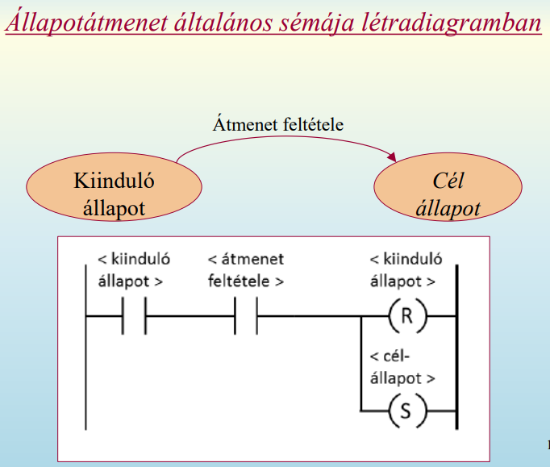
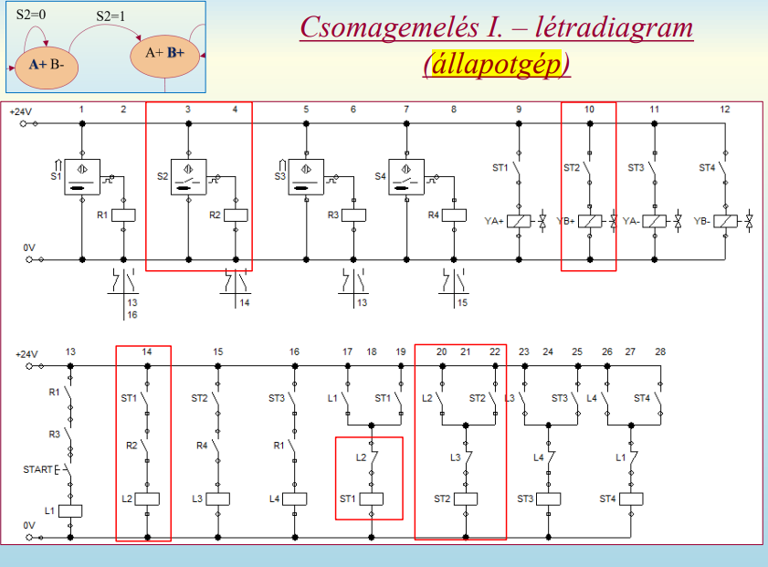

## 5. Állapotgép fogalma. Állapotátmenet sémája létradiagramban. Léptetőlánc megvalósítása relés kapcsolással

- állapotgép fogalma
  - olyan program, amely a bemenetei hatására a belső, véges számú állapot között lépked
  - minden bemenet-állapot pároshoz csak egy darab, pontosan meghatározott következő állapot tartozik
  - mindig egy bizonyos állapotban van, és attól függően reagál az eseményekre
  - az események hatására állapotátmenet történhet
  - megadása állapotátmeneti gráffal vagy táblázattal lehetséges
  - kiegészítő fogalmak
    - állapot
      - memóriajelleggel rendelkező rendszerekben a múlt összesített hatása
    - állapotváltozó
      - az állapot egyértelmű leírásához szükséges mennyiségi vagy minőségi változó (?)
      - lehet időfüggvény vagy logikai változó
- 
- 
