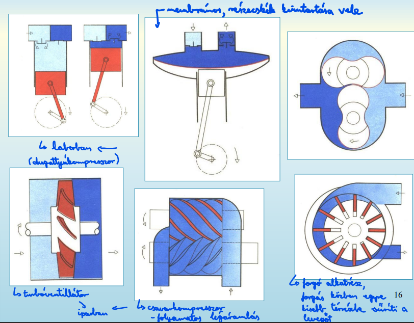

## 6. A sűrített levegő, mint munkavégző közeg előnyei és hátrányai. A technológiai sűrített levegő előkészítése és eszközei. A pneumatikus elemek csoportosítása. A pneumatikus jelképrendszer bemutatása a szelepek jelképein keresztül

- nagynyomású levegő (2-10 bar)
  - előnyei
    - mindenütt, korlátlan mennyiségben megtalálható
    - csővezetéken nagy távolságra szállítható, a visszavezetésről nem kell gondoskodni
      - (egyszerű szétosztás)
    - tartályban, palackban is tárolható
    - érzéketlen a hőmérsékletváltozásokra
    - környezetbarát, tiszta közeg (pl. gyógyszeriparnál különösen fontos)
      - rendszer sérülésekor sem szennyezi a környezetet
    - gyors munkaközeg
      - pneumatikus munkahenger sebessége 1-2 m/s
    - erők és a sebesség fokozatmentesen szabályozható (analóg rendszer)
    - elemek egészen a teljes megállásig túlterhelhetők
    - munkavégző elemek felépítése egyszerű, alacsony költségű
    - nagy energiasűrűség
    - pneumatikus motor teljesítmény/tömeg aránya kedvezőbb a villamos motorokénál, ami kézi szerszámoknál előnyös
      - fogászati fúró, gumiszerelő légkulcs
    - lineáris mozgások könnyen megvalósíthatók egyszerű és nagy megbízhatóságú elemekkel, irányváltás egyszerűen megoldható
    - karbantartás egyszerű
      - “életreszóló” kenés
  - hátrányai
    - levegő összenyomhatósága miatt nem lehet állandó, egyenletes dugattyúsebességet elérni
    - csak egy meghatározott erőkifejtésig gazdaságos
    - kipufogó levegő hangos
    - jó előkészítést igényel
    - drága energiahordozó
  - veszteségforrások
    - kompresszor motor és mechanikai eredetű veszteségei
    - sűrített levegő visszahűtése
    - kompresszor be/kikapcsolási üresjáratai
    - hűtveszárító termikus veszteségei
    - léghálózat-rendszer
      - nyomáseséséből fakadó veszteségek
      - szivárgási veszteségek
    - pneumatikus elemeken bekövetkező nyomásesés
      - (pl. szűrő, szabályzó)
    - munkavégző elemek súrlódási veszteségei
    - munkahengerben maradt nagynyomású levegő szabadba eresztése

- technológiai sűrített levegő előkészítése
  - kompresszorokkal kívánt nyomásra sűrítés
  - 
  - 
  - hűtve szárítás
    - harmatpont-hőmérsékletre történő hűtés elvén
    - korrózióvédelem pára (kicsapódás) ellen
  - adszorpciós szárítás
    - fizikai eljárás
    - szárítótöltet porózus, nagy felületű anyag (gél)
      - lekötőképessége korlátozott
        - telítődés után regenerálható felmelegített levegő átfuvatásával
  - légszűrő
    - szennyeződések eltávolítására
    - ahol kell, finomszűrő is (fokozott tisztaság érdekében)
  - nyomásszabályzó

- pneumatikus elemek csoportosítása
  - előállításhoz
    - kompresszor
      - típusok…
    - légtartály
    - csőhálózat
    - levegőszűrő
    - nyomásszabályozó
    - (olajozó)
  - végrehajtó
    - forgó mozgást végző elemek
    - munkahengerek
      - egyszeres
      - kétszeres működtetésű
      - dugattyúrúd nélküli
        - szalag vagy kötél vontatású
        - tömítőszalagos (zipzár)
      - különleges kivitelű
        - átmenő dugattyúrudas
        - tandemhengeres
  - irányító
    - nyomásállító
    - térfogatáram állító
    - logikai
      - és
      - vagy
    - útszelepek
      - alaphelyzetben nyitott/zárt
    - időzítő

- pneumatikus jelképrendszer bemutatása a szelepek jelképeivel
  - 
  - 
  -
