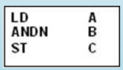
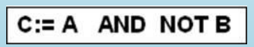
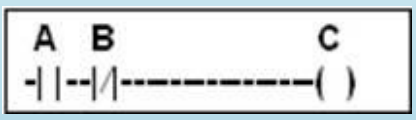
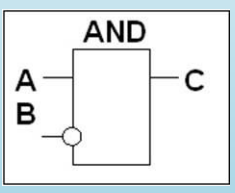
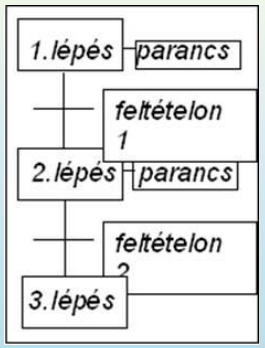

## 9. PLC-k funkcionális egységei. PLC program-hierarchia, felhasználói programnyelvek típusai

- PLC-k funkcionális felépítése
  - központi logikai feldolgozóegység (LU, CPU)
  - programmemória (ROM, EEPROM, NAND/NOR-Flash)
  - adatmemória (RAM)
  - bemeneti (input) egységek (logikai/digitális, analóg)
  - kimeneti (output) egységek (logikai/digitális, analóg)
  - kommunikációs egységek (COM, TCP/IP, terepi buszok)
  - (programozóegység)
  - (tápegység)

- programhierarchia
 1. PLC gyártó (alapszoftver)
 2. célgép gyártó (felhasználói program)
  - operációs rendszer hozzáféréséhez nincs jogosultság
 3. célgép üzemeltető
  - tesztek, szűk beállítási funkciók
  - felhasználói programhoz és operációs rendszerhez sem fér hozzá
 4. Gépkezelő (operátor)
  - csak kezelőgombokat használhat
  - technológiai paramétereket állít
  - programokhoz nem fér hozzá

- Felhasználói programnyelvek típusai
  - IEC 1131-3 standard alapján
  - szöveges
    - IL (Instruction List)
      - Assembly jellegű
      - 
    - ST (Structured Text)
      - PASCAL-ra emlékeztető
      - 
  - grafikus
    - LD (Ladder Diagram)
      - korábban relékhez használt
      - 
    - FBD (Function Block Diagram)
      - blokkjai a létradiagramban is használhatók
      - áramköri rajz jellegű
      - 
    - SFC (Sequential Function Chart)
      - léptetőlánc
      - sorosan és párhuzamosan végrehajtandó lépések sorozata
      - szemléletes
      - állapotgép
      - 
