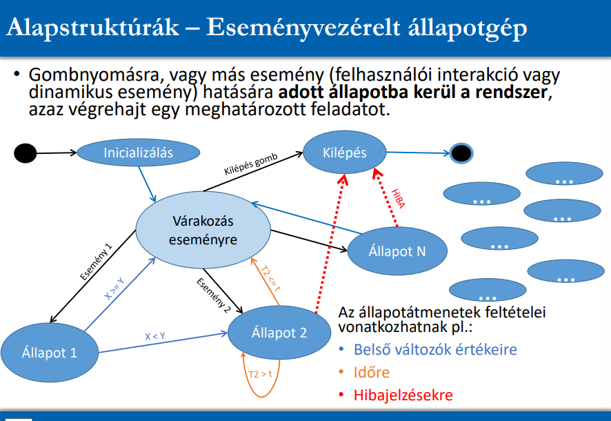

## 3. Mi az eseményvezérelt állapotgép (definíció, szemléltető ábra)? Milyen előnyei vannak az eseményvezérelt programozásnak a ciklikus lekérdezéssel szemben? Mi a „sequencer” (sorozat- végrehajtó) állapotgép (definíció, szemléltető ábra)?

- eseményvezérelt állapotgép
  - 
  - kis késleltetés érhető el
    - nem kell várni egy újabb ellenőrző iterációra a ciklusban
  - sorrendfüggetlen
    - ciklusbeli működés függhet attól, hogy a ciklusban milyen sorrendben hívjuk meg a kezelőfüggvényeket, eseménykezelésnél ilyesmi nincs
  - priorizálható, melyik eseményt kezeljük le
    - (bár ez ciklikus lekérdezéssel is megoldható, ha először begyűjtjük az eseményeket, majd egy fontossági sorrend alapján döntünk a kezelésükről)
  - processzor tehermentesíthető
    - nem kell folyamatosan a ciklusban iterálni, elég csak az eseménykezelések során foglalkozni az alkalmazással
- sequencer
  - 
